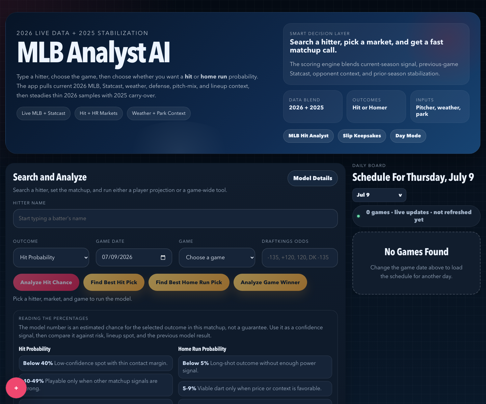
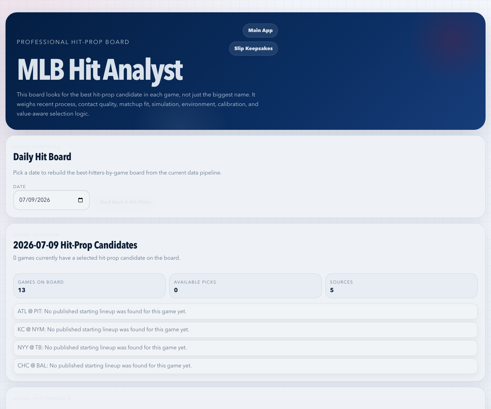
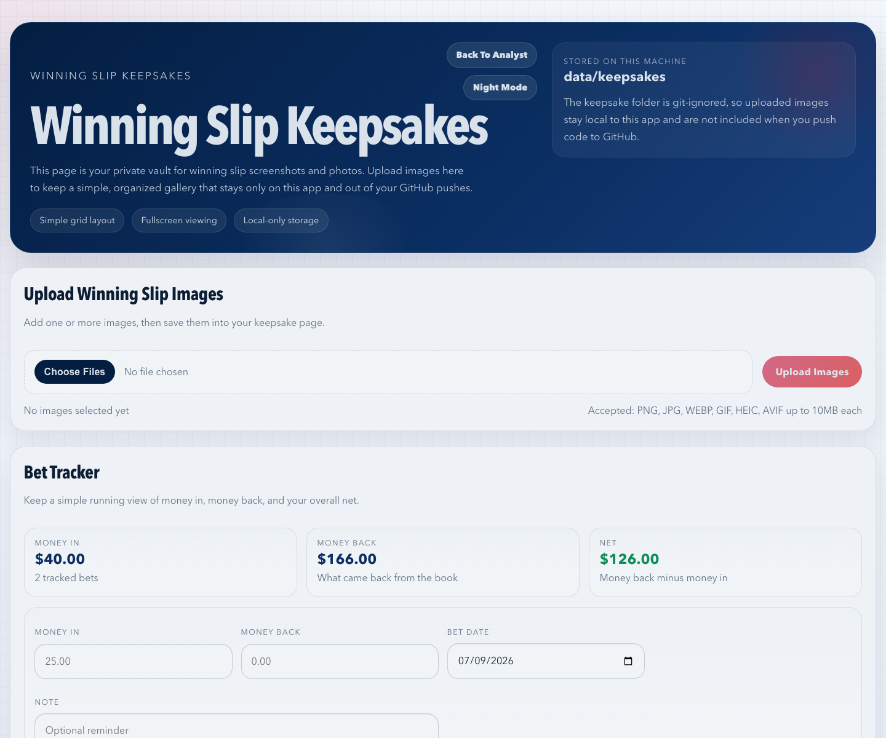

# MLB Analyst AI

MLB Analyst AI is a local Next.js app for researching MLB hitter props, home-run spots, best hitters by game, game-winner context, and prediction feedback.

It is built for people who want a transparent baseball analysis tool they can run themselves. The core model works without paid services. Optional API keys add AI summaries and sportsbook odds.

> This project is for research and learning. It is not financial advice or a guaranteed betting model.

## Screenshots

### Main Analyst



### Daily Hit Analyst Dashboard



### Winning Slip Keepsakes



## What The App Does

- Searches active MLB hitters.
- Loads MLB games by date.
- Pulls probable pitchers, venues, lineups, weather, park context, Statcast-style signals, and team context.
- Estimates hit probability, 2+ hit probability, and home-run probability.
- Ranks the best hitter for each game when lineup data is available.
- Predicts game winners with pitcher, bullpen, offense, defense, park, and weather context.
- Compares model probability against optional DraftKings-style American odds.
- Stores local predictions and feedback so you can review calibration over time.
- Includes a terminal chat agent that can remember your preferences and explain recent predictions.
- Lets you locally save winning slip screenshots under `data/keepsakes/`.

## Requirements

Install these before starting:

- Node.js `20.9.0` or newer.
- npm, which comes with Node.
- Git.

Recommended:

- Node.js 22 or newer. The chat memory system uses Node's built-in SQLite support, which is still marked experimental by Node.
- Python 3 if you want to run the optional model training scripts in `ml/`.

## Quick Start

Clone the repo:

```bash
git clone <your-repo-url>
cd MLBAnalystAI
```

Install dependencies:

```bash
npm install
```

Create your local environment file:

```bash
cp .env.example .env.local
```

Start the app:

```bash
npm run dev
```

Open the app:

```text
http://localhost:3000
```

Useful pages:

- Main analyst: `http://localhost:3000`
- Hit analyst dashboard: `http://localhost:3000/hit-analyst`
- Winning slip keepsakes: `http://localhost:3000/keepsakes`

## Environment Variables

Your private keys go in `.env.local`. Do not commit `.env.local` to GitHub.

The repo includes `.env.example`:

```bash
OPENAI_API_KEY=
ODDS_API_KEY=your_api_key_here
ODDS_DEFAULT_REGION=us
ODDS_FORMAT=american
ODDS_BOOKMAKERS=
ODDS_PREFERRED_BOOKMAKERS=draftkings
```

### Required Keys

None.

The main deterministic MLB analysis can run without any private API key. The app uses public baseball and weather endpoints for most of its data.

### Optional Keys

| Variable | Needed for | What happens if missing |
| --- | --- | --- |
| `OPENAI_API_KEY` | AI-written summaries and terminal chat reasoning | The model still runs, but AI summaries return `null` and chat features are limited. |
| `ODDS_API_KEY` | The Odds API moneyline and player-prop odds | The model still runs, but live sportsbook odds and no-vig market context are unavailable. |
| `ODDS_DEFAULT_REGION` | The Odds API region | Defaults to `us`. |
| `ODDS_FORMAT` | Odds display format | Defaults to `american`. |
| `ODDS_BOOKMAKERS` | Restrict odds requests to specific books | Empty means the Odds API can return its normal bookmaker set. |
| `ODDS_PREFERRED_BOOKMAKERS` | Pick the first book to prefer when many are available | Defaults to `draftkings`. |
| `NOMINATIM_USER_AGENT` | Optional geocoding fallback | Uses a default local user agent if unset. |

Example `.env.local`:

```bash
OPENAI_API_KEY=sk-your-openai-key
ODDS_API_KEY=your-odds-api-key
ODDS_DEFAULT_REGION=us
ODDS_FORMAT=american
ODDS_BOOKMAKERS=
ODDS_PREFERRED_BOOKMAKERS=draftkings
NOMINATIM_USER_AGENT="MLBAnalystAI/1.0 your-email-or-site"
```

## How The API Connections Work

The app combines several data sources. Most are called from server-side API routes in `src/app/api/`, so private keys are not exposed to the browser.

| Source | Used for | Key required | Main code |
| --- | --- | --- | --- |
| MLB StatsAPI | Schedules, games, players, teams, venues, probable pitchers, lineups, season stats | No | `src/lib/mlb.ts` |
| Baseball Savant / Statcast CSV endpoints | Expected stats, contact signals, pitch mix, sprint speed, defense, matchup context | No | `src/lib/statcast.ts` |
| Open-Meteo | Forecast weather for games | No | `src/lib/weather.ts`, `src/lib/providers/open-meteo-provider.ts` |
| The Odds API | Moneyline odds, batter hit props, batter home-run props | Yes, `ODDS_API_KEY` | `src/lib/vegas-odds-service.ts` |
| OpenAI Responses API | Short AI summaries and chat-agent reasoning | Yes, `OPENAI_API_KEY` | `src/lib/ai.ts`, `src/agent/` |
| ESPN Site/Core APIs | Optional event and context enrichment | No, unofficial public endpoints | `src/lib/providers/espn-site-provider.ts`, `src/lib/providers/espn-core-provider.ts` |
| Nominatim OpenStreetMap | Venue geocoding fallback | No key, but User-Agent recommended | `src/lib/providers/nominatim-provider.ts` |
| Sunrise-Sunset | Daylight and first-pitch timing context | No | `src/lib/providers/sunrise-sunset-provider.ts` |

### Request Flow In Plain English

1. The browser asks this app's own API routes for data.
2. The Next.js server route calls MLB, weather, odds, or AI providers as needed.
3. Provider failures are caught where possible.
4. Missing data becomes warnings or lower confidence instead of invented data.
5. Predictions and feedback are saved locally in `data/`.

### OpenAI Connection

OpenAI is only used when `OPENAI_API_KEY` is present.

The main UI calls `/api/analyze`, which builds the deterministic baseball model first. Then `src/lib/ai.ts` asks OpenAI for a short explanation of the result. If OpenAI fails or the key is missing, the API still returns the baseball analysis without the AI paragraph.

The terminal agent uses:

```bash
npm run chat
```

The agent can:

- Explain recent predictions.
- Remember stable user preferences.
- Parse feedback like `Aaron Judge got a hit`.
- Store memory in local SQLite at `data/agent-memory.sqlite`.

### The Odds API Connection

The odds layer lives in `src/lib/vegas-odds-service.ts`.

It supports these MLB markets:

- `h2h` for moneyline.
- `batter_hits` for hitter hit props.
- `batter_home_runs` for hitter home-run props.

The app normalizes sportsbook odds into:

- American odds.
- Implied probability.
- No-vig probability when both sides are available.
- Fair odds from the model probability.
- Edge between the model and the book price.
- Value rating.

If `ODDS_API_KEY` is missing, odds routes return warnings and the analyst engine skips sportsbook context.

## App Pages

| Page | URL | Purpose |
| --- | --- | --- |
| Main analyst | `/` | Search one hitter, choose a game and market, then run hit, HR, best-hitter, or game-winner analysis. |
| Hit analyst dashboard | `/hit-analyst` | Shows the best hitter per game for a date, alternatives, warnings, and calibration context. |
| Winning slip keepsakes | `/keepsakes` | Upload and store local winning slip images. Files stay on your machine. |

## API Reference

Run the app locally first:

```bash
npm run dev
```

Then call routes at `http://localhost:3000`.

### Games And Players

#### Get Games By Date

```http
GET /api/games?date=2026-07-09
```

Returns MLB games for the date, lineup status, and weather when available.

#### Search Batters

```http
GET /api/players/search?q=Judge
```

Returns matching current batters. Queries shorter than 2 characters return an empty list.

#### Player History

```http
GET /api/players/592450/history
```

Returns stored or computed player history for a player id.

### Core Analysis

#### Analyze A Player

```http
POST /api/analyze
Content-Type: application/json

{
  "playerId": 592450,
  "gamePk": 777123,
  "market": "hit",
  "manualOdds": "-135",
  "sportsbook": "DraftKings"
}
```

Supported `market` values:

- `hit`
- `hit_2_plus`
- `home_run`

Notes:

- `playerId` and `gamePk` are required.
- `manualOdds` is optional.
- Manual odds currently support DraftKings-style American odds only.
- The route appends the prediction to `data/predictions.ndjson`.

#### Analyze A Lineup

```http
POST /api/analyze-lineup
Content-Type: application/json

{
  "gamePk": 777123,
  "market": "hit"
}
```

Runs game-wide hitter analysis when lineup data is available.

#### Game Winner Prediction

```http
POST /api/game-win-prediction
Content-Type: application/json

{
  "gamePk": 777123
}
```

Also available:

```http
GET /api/games/777123/win-prediction
GET /api/games/today/win-predictions
```

### MLB Analyst Engine

#### Player Hit Analysis

```http
GET /api/mlb/player-hit-analysis?playerName=Aaron%20Judge&gameId=777123&market=hit
```

Also supports `POST` with JSON.

Accepted fields:

- `playerId` or `playerName`
- `gameId` or `gamePk`
- `date`
- `market=hit|hit_2_plus|home_run`
- `manualOdds`
- `sportsbook`

#### Deep Analyst Prediction

```http
GET /api/mlb/analyst/prediction?playerName=Aaron%20Judge&gameId=777123&market=hit&sportsbookOdds=-135
```

Supported markets:

- `hit`
- `hit_2_plus`
- `home_run`
- `total_bases`
- `rbi`
- `runs`

This route returns probability, fair odds, confidence, lean, reasons for and against, simulation context, game script notes, matchup notes, weather/park context, market context, and warnings.

#### Best Hitters Today

```http
GET /api/mlb/best-hitters-today
```

Returns the best hitter board for today's games.

#### Best Hitters By Date

```http
GET /api/mlb/best-hitters-by-game?date=2026-07-09
```

If lineups are not posted yet, the route returns warnings instead of guessing fake batting orders.

#### Game Hit Board

```http
GET /api/mlb/game-hit-board?gameId=777123
```

Returns a board of hitter candidates for one game.

#### Model Performance

```http
GET /api/mlb/model-performance
```

Returns calibration and model-performance context from local feedback files and available model artifacts.

#### Submit MLB Feedback

```http
POST /api/mlb/feedback
Content-Type: application/json

{
  "playerId": 592450,
  "playerName": "Aaron Judge",
  "gamePk": 777123,
  "market": "hit",
  "probability": 0.67,
  "actualResult": true,
  "featuresUsed": ["last10", "simulation", "pitcherMatchup"],
  "notes": "Good process call"
}
```

### Odds Routes

#### Moneyline Odds

```http
GET /api/odds/mlb/moneyline?date=2026-07-09
```

Requires `ODDS_API_KEY` for live odds.

#### Player Prop Odds For An Event

```http
GET /api/odds/mlb/event/<eventId>/player-props?markets=batter_hits,batter_home_runs
```

Use the event id returned by The Odds API matching layer.

#### Odds For A Game

```http
GET /api/odds/mlb/game/777123
```

Maps an MLB game id to available odds context when possible.

#### Odds For One Player

```http
GET /api/odds/mlb/player?playerName=Aaron%20Judge&gameId=777123&market=batter_hits
```

Supported markets:

- `batter_hits`
- `batter_home_runs`

### Prediction Feedback And Calibration

#### Natural-Language Feedback

```http
POST /api/predictions/feedback
Content-Type: application/json

{
  "message": "Aaron Judge got a hit",
  "source": "user_chat"
}
```

The app tries to match the message to recent unresolved predictions.

#### Direct Resolution

```http
POST /api/predictions/resolve
Content-Type: application/json

{
  "predictionId": "prediction-id",
  "actualOutcome": "hit"
}
```

#### Read Prediction State

```http
GET /api/predictions/recent
GET /api/predictions/unresolved
GET /api/predictions/calibration
```

#### Export Training Rows

```http
POST /api/predictions/export
```

Or run:

```bash
npm run export:resolved
```

Writes:

- `data/training/resolved_predictions.csv`
- `data/training/resolved_predictions.jsonl`

### Agent Routes

#### Chat

```http
POST /api/agent/chat
Content-Type: application/json

{
  "message": "What did you like about the last hit pick?",
  "sessionId": null
}
```

#### Sessions And Memory

```http
GET /api/agent/sessions
GET /api/agent/sessions/<sessionId>
GET /api/agent/memory
POST /api/agent/feedback
```

`/api/agent/memory` is intended for development inspection.

### Keepsakes

#### List Keepsakes

```http
GET /api/keepsakes
```

#### Upload Keepsake

```http
POST /api/keepsakes
Content-Type: multipart/form-data

image=<image file>
```

Images must be 10MB or smaller. They are stored locally under `data/keepsakes/`.

#### Delete Keepsake

```http
DELETE /api/keepsakes/<id>
```

## Local Data Files

The app writes local state into `data/`.

Common files:

| File | Purpose |
| --- | --- |
| `data/predictions.ndjson` | Saved prediction records. |
| `data/feedback.ndjson` | Manual feedback records. |
| `data/outcome-feedback.ndjson` | Resolved outcome feedback. |
| `data/agent-memory.sqlite` | Terminal agent memory and chat sessions. |
| `data/keepsakes/` | Uploaded slip images and manifest. |
| `data/provider-cache/` | Provider cache files. |

These files are local runtime state. They should usually stay out of GitHub.

## GitHub Clone Checklist

When someone else clones this project, they need to:

1. Install Node.js.
2. Run `npm install`.
3. Copy `.env.example` to `.env.local`.
4. Add optional keys if they want OpenAI summaries or live odds.
5. Run `npm run dev`.
6. Open `http://localhost:3000`.

They do not need your `.env.local`, your `node_modules`, your `.next` folder, or your local `data/` history.

## Development Commands

```bash
npm run dev
npm run build
npm run start
npm run lint
npm test
npm run chat
npm run export:resolved
npm run eval:hit-context
```

What they do:

- `npm run dev`: starts the local development server.
- `npm run build`: verifies the production build.
- `npm run start`: runs the production build after `npm run build`.
- `npm run lint`: runs ESLint.
- `npm test`: runs the Node test suite.
- `npm run chat`: starts the terminal MLB memory agent.
- `npm run export:resolved`: exports resolved prediction outcomes.
- `npm run eval:hit-context`: evaluates hit-context features using the local training CSV.

## Optional Python Training

Install Python dependencies:

```bash
python -m pip install -r ml/requirements.txt
```

Train the hit model:

```bash
python ml/train_hit_model.py --input data/player_game_training.csv
```

Evaluate hit game context:

```bash
python3 ml/evaluate_hit_game_context.py --input data/player_game_training.csv --output data/evaluation/hit_context_eval.json
```

Train the game-winner model:

```bash
python ml/train_game_win_model.py --input data/game_win_training.csv
```

Training scripts write artifacts under `ml/artifacts/` and reports under `data/`.

## Deployment Notes

This app is easiest to run locally.

For Vercel or another hosted environment:

1. Add the same environment variables in the hosting dashboard.
2. Use Node.js `20.9.0` or newer.
3. Remember that serverless file systems are usually temporary.

Important hosting caveat:

The app currently writes predictions, feedback, memory, provider cache, and keepsakes to local files under `data/`. On serverless hosting, those files may disappear between deployments or function restarts. For a production hosted version, move runtime state to durable storage such as Postgres, SQLite on a persistent volume, S3-compatible object storage, or another database/storage service.

## Troubleshooting

### The page loads, but there are no games

- Check the selected date.
- Some offseason or off days have no games.
- The MLB API can occasionally be slow or unavailable.

### Best hitter routes return warnings

That usually means official lineups are not posted yet. The app avoids inventing batting orders.

### Odds are missing

- Make sure `ODDS_API_KEY` is set in `.env.local`.
- Restart `npm run dev` after editing `.env.local`.
- Player props may not be posted yet for that game.
- Some books do not offer every player or every market.

### AI summaries are missing

- Make sure `OPENAI_API_KEY` is set in `.env.local`.
- Restart the server.
- The deterministic model still works when OpenAI is unavailable.

### The chat agent warns about SQLite

Node currently marks `node:sqlite` as experimental. The app can still run, but use a current Node version.

### Manual odds are rejected

Manual odds currently accept DraftKings-style American odds. Examples:

```text
-135
+120
DK -135
DraftKings -135
```

### Build check

Run:

```bash
npm run build
```

If this passes, the app compiles and the API routes are discoverable by Next.js.

## Project Structure

```text
src/app/                    Next.js pages and API routes
src/components/             Main UI components
src/lib/                    MLB, odds, weather, model, scoring, and provider logic
src/agent/                  Terminal chat agent
src/db/                     Local SQLite schema and repository
src/outcomes/               Prediction feedback and calibration system
ml/                         Optional Python model training scripts
docs/                       Model notes and README screenshots
data/                       Local runtime state, usually ignored by Git
tests/                      Node test suite
```

## Notes For Contributors

- Keep `.env.local` private.
- Do not commit personal prediction history, memory DBs, local cache files, or keepsake images.
- Prefer adding warnings when external data is missing instead of fabricating values.
- Keep model outputs explainable: probability, confidence, reasons for, reasons against, and data-quality warnings should stay visible.

